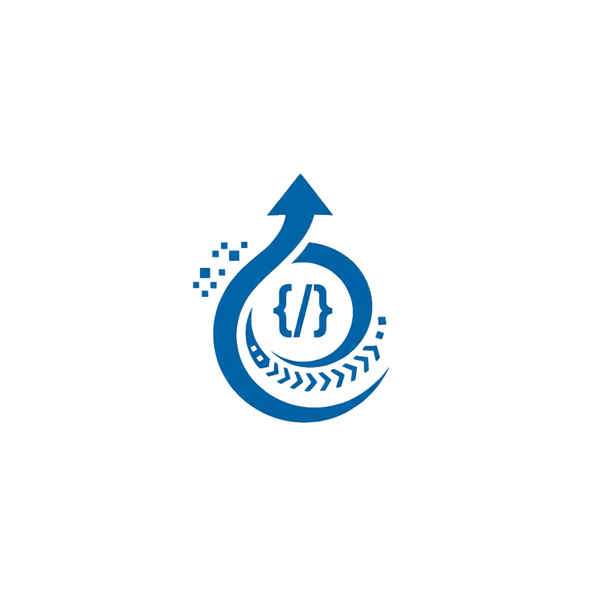

<p align="center"></p>

# Ingenia — Documento Final do Sistema

### Artefato 4 — Documento Final (Entrega Final do Projeto)

**Projeto:** Ingenia — Plataforma Digital de Ensino Introdutório de Programação
**Público-alvo:** Estudantes do 8º e 9º ano do ensino fundamental
**Link de acesso à aplicação:** https://ingenia.synaptha.com

> **Credenciais de demonstração**
>
> | Perfil | E-mail | Senha |
> |--------|--------|-------|
> | Administrador | `admin@hub.dev` | `admin123` |
> | Professor | `teacher1@hub.dev` | `teacher123` |
> | Aluno | `user@hub.dev` | `user123` |

---

## Sumário

1. [Visão Geral do Sistema](#1-visão-geral-do-sistema)
2. [Objetivos e Problema Resolvido](#2-objetivos-e-problema-resolvido)
3. [Escopo Entregue (coerência com o backlog)](#3-escopo-entregue-coerência-com-o-backlog)
4. [Perfis de Usuário (Personas)](#4-perfis-de-usuário-personas)
5. [Funcionalidades Desenvolvidas](#5-funcionalidades-desenvolvidas)
6. [Jornadas de Usuário (J-001 a J-008)](#6-jornadas-de-usuário-j-001-a-j-008)
7. [Regras de Negócio (BR-001 a BR-020)](#7-regras-de-negócio-br-001-a-br-020)
8. [Arquitetura do Sistema](#8-arquitetura-do-sistema)
9. [Modelo de Dados](#9-modelo-de-dados)
10. [Decisões Técnicas Relevantes](#10-decisões-técnicas-relevantes)
11. [Segurança e Controle de Acesso](#11-segurança-e-controle-de-acesso)
12. [Qualidade e Testes](#12-qualidade-e-testes)
13. [Implantação (Deploy)](#13-implantação-deploy)
14. [Resultados e Aprendizados](#14-resultados-e-aprendizados)

---

## 1. Visão Geral do Sistema

A **Ingenia** é uma plataforma web educacional que transforma o "começar a programar" em uma jornada clara e guiada. O aluno assiste a uma aula em vídeo, lê o conteúdo escrito, resolve exercícios em **Python diretamente no navegador**, recebe **feedback imediato** com correção automática e acompanha seu progresso módulo a módulo.

A trilha é organizada em **módulos progressivos** que cobrem os fundamentos da programação em Python:

1. **Primeiro contato e Pensamento Computacional** — o que é programação e como os computadores pensam.
2. **Variáveis e Tipos de Dados** — variáveis, tipos numéricos, strings e conversão de tipos.
3. **Coleções (Listas, Tuplas e Dicionários)** — armazenar e organizar vários valores em uma única variável.
4. **Estruturas Condicionais** — controle de fluxo com `if`, `elif`, `else` e operadores de comparação.
5. **Estruturas de Repetição** — uso de `while` e `for` para repetir tarefas e iterar sobre sequências.
6. **Funções** — criar funções para organizar e reutilizar código, de definições básicas até recursão.

O conteúdo não é fixo no código: módulos, aulas e exercícios são gerenciados pelo administrador via painel.

A plataforma atende três perfis distintos:

- **Aluno** — percorre a trilha, consome conteúdo, resolve exercícios e acompanha sua evolução.
- **Professor** — organiza turmas e acompanha o desempenho coletivo e individual dos alunos.
- **Administrador** — gerencia todo o conteúdo pedagógico e os usuários da plataforma.

---

## 2. Objetivos e Problema Resolvido

### Problema

Oferecer uma introdução **prática, guiada e acessível** à programação para estudantes sem experiência prévia é difícil: falta um ambiente único que combine teoria, prática e retorno imediato sobre o aprendizado.

### Objetivo Principal

Oferecer uma plataforma estruturada e intuitiva para o ensino introdutório de programação a alunos do 8º e 9º ano, com foco em **aprendizagem ativa** por meio de conteúdo guiado, prática e feedback imediato.

### Objetivos Secundários

- Organizar o ensino em módulos progressivos sobre conceitos básicos de programação.
- Permitir assistir videoaulas, consultar material escrito e resolver exercícios em um único ambiente.
- Disponibilizar correção automática que executa testes internos e informa se a solução atende ao esperado.
- Oferecer ao professor um painel de acompanhamento de progresso e desempenho por turma.
- Disponibilizar ao administrador o controle sobre módulos, aulas, exercícios e usuários.
- Garantir autenticação, controle de permissões e proteção básica de dados e acessos.

### Critérios de Sucesso (atingidos)

- ✅ O aluno percorre uma trilha visual e identifica seu progresso ao longo dos módulos.
- ✅ O aluno submete código na plataforma e recebe retorno automático sobre o resultado.
- ✅ O professor visualiza o andamento dos estudantes e o desempenho por turma.
- ✅ O administrador cadastra e organiza conteúdos, exercícios e usuários sem depender de processos externos.
- ✅ A navegação é simples e adequada ao público iniciante, com foco em desktop (conforme definido para a 1ª versão).

---

## 3. Escopo Entregue (coerência com o backlog)

O desenvolvimento foi organizado em **6 fases incrementais** (Fase 0 a Fase 5), rastreadas em um *issue tracker* com 18 issues-pai decompostas em 58 sub-issues (65 itens rastreáveis no total). As funcionalidades abaixo refletem o que foi **efetivamente implementado**, em coerência com os requisitos das entregas anteriores.

| Fase | Tema | Entregas principais | Status |
|------|------|---------------------|--------|
| **Fase 0** | Fundação | Modelagem de dados de todos os domínios (accounts, curriculum, classes, submissions, progress), Django Admin e *seed* de dados | ✅ Concluída |
| **Fase 1** | Autenticação & Autorização | JWT com *role* no payload, registro público, recuperação de senha, permissões por perfil, telas de login/registro/erro e guards de rota | ✅ Concluída |
| **Fase 2** | Administração de Conteúdo | CRUD completo de módulos, aulas, vídeo-aulas, exercícios e casos de teste; CRUD de usuários; dashboard com métricas | ✅ Concluída |
| **Fase 3** | Experiência do Aluno | Trilha, leitura de conteúdo, editor de código (Monaco), motor de correção Skulpt, submissão, feedback, progresso e histórico | ✅ Concluída |
| **Fase 4** | Experiência do Professor | CRUD de turmas, matrícula de alunos, progresso coletivo e individual | ✅ Concluída |
| **Fase 5** | Segurança, Polish & Validação | Refinamentos de UX, revisão de autorização e validação E2E das jornadas | ✅ Concluída |

> **Cobertura do MVP:** as 15 funcionalidades *Must-Have* definidas no documento de escopo foram entregues. Itens explicitamente *fora de escopo* (gamificação avançada, chat em tempo real, integração com sistemas escolares, app mobile nativo, certificação, aulas ao vivo e suporte a múltiplas linguagens) **não** foram desenvolvidos, conforme planejado.

### Funcionalidades *Must-Have* (MVP) — todas entregues

| # | Funcionalidade |
|---|----------------|
| 1 | Autenticação de usuários (login seguro por perfil) |
| 2 | Gestão de perfis e permissões (aluno / professor / administrador) |
| 3 | Trilhas de aprendizagem por módulos progressivos |
| 4 | Aulas com videoaula e material escrito |
| 5 | Exercícios práticos de programação |
| 6 | Editor de código no navegador |
| 7 | Correção automática com testes internos |
| 8 | Feedback automático ao aluno |
| 9 | Visualização de progresso do aluno |
| 10 | Interface simples e guiada |
| 11 | Painel do professor |
| 12 | Gestão de turmas |
| 13 | Painel administrativo de conteúdo |
| 14 | Gestão de usuários pelo administrador |
| 15 | Medidas básicas de segurança |

---

## 4. Perfis de Usuário (Personas)

| Perfil | Persona | Capacidade principal | Restrições de acesso |
|--------|---------|----------------------|----------------------|
| **Aluno** | Estudante do 8º/9º ano, iniciante em programação | Navegar a trilha, consumir aulas, submeter exercícios e ver o próprio progresso | Vê apenas conteúdo publicado e somente os próprios dados |
| **Professor** | Professor do ensino fundamental | Criar/gerenciar turmas, matricular alunos e monitorar progresso coletivo e individual | Vê apenas as próprias turmas e alunos matriculados |
| **Administrador** | Administrador da plataforma | Gerenciar módulos, aulas, exercícios e usuários; visualizar métricas | Acesso completo a conteúdo e usuários, independente de vínculo com turma |

Após o login, o usuário é **redirecionado automaticamente** para a área correta conforme seu perfil (`/student`, `/teacher` ou `/admin`).

---

## 5. Funcionalidades Desenvolvidas

### 5.1 Autenticação e Conta (domínio `auth` / app `accounts`)

- **Login** com e-mail e senha, com redirecionamento por perfil.
- **Registro público** de alunos (cria `User` + `StudentProfile`).
- **Recuperação de senha** em duas etapas (solicitar link por e-mail → redefinir com token).
- **Bloqueio de contas inativas** no login.
- **Sessão com JWT** (access + refresh) e renovação automática transparente do token.
- **Telas de erro** dedicadas: 403 (Não Autorizado) e 404 (Não Encontrado).

### 5.2 Área do Aluno (domínio `student`)

- **Dashboard / Trilha** com cartões de estatística e CTA *"Continuar de onde parei"*.
- **Lista de módulos** com busca e filtro de progresso (todos / em andamento / concluídos).
- **Detalhe do módulo** com barra de progresso e lista sequencial de aulas com indicadores de status.
- **Tela de aula** com player de vídeo embutido (YouTube/Vimeo), conteúdo em Markdown, lista de exercícios e navegação anterior/próxima. A aula é marcada automaticamente como *iniciada* ao ser acessada.
- **Tela de exercício** com:
  - **Editor de código Monaco** (Python, tema escuro, numeração de linhas).
  - **Execução de Python no navegador via Skulpt** (sem servidor de execução).
  - **Console de saída** (stdout/stderr) estilo terminal.
  - **Avaliação automática** contra casos de teste visíveis e ocultos, com resultado PASSED / FAILED / ERROR.
  - **Feedback pedagógico instantâneo** que orienta sem expor a resposta completa (BR-013).
  - **Botão de dica** e **histórico de tentativas** por exercício.
- **Tela de progresso** consolidado com *ring progress*, cartões por módulo e contagens.
- **Histórico geral de submissões** com filtro por status, paginação e modal de detalhe (feedback + código-fonte).

### 5.3 Área do Professor (domínio `teacher`)

- **Dashboard** com métricas (turmas, alunos, turmas ativas, média de alunos por turma).
- **CRUD de turmas** (criar, listar, detalhar, editar; status ativo/arquivado).
- **Matrícula de alunos** por busca, com seleção múltipla.
- **Progresso coletivo** da turma (quantos iniciaram, módulos concluídos, exercícios resolvidos).
- **Progresso individual** com *drill-down* por módulo → aula → exercício.
- **Lista de alunos** entre turmas, com filtros.

### 5.4 Área do Administrador (domínio `admin`)

- **Dashboard** com métricas agregadas (módulos, aulas, exercícios, usuários).
- **CRUD completo de currículo**: Módulos → Aulas → Exercícios → Casos de Teste (estrutura aninhada).
- **Fluxo de publicação** (rascunho / publicado / arquivado) com alertas de validação:
  - aula só publica com material escrito **e** vídeo (BR-008);
  - exercício só publica com **ao menos um** caso de teste (BR-010).
- **CRUD de usuários** por perfil (aluno, professor, admin), com criação do *profile* correspondente.
- **Visão read-only de turmas** para acompanhamento.

### 5.5 Página Pública (domínio `landing`)

- **Landing page** com hero, apresentação do problema, abordagem de aprendizagem, jornada de módulos e CTAs para login/registro. Usuários autenticados são redirecionados automaticamente para sua área.

---

## 6. Jornadas de Usuário (J-001 a J-008)

As funcionalidades foram especificadas e validadas a partir de **8 jornadas críticas**, que orientaram também os testes ponta a ponta (E2E).

| ID | Jornada | Perfil |
|----|---------|--------|
| **J-001** | Fazer login e acessar a área correta conforme o perfil | Todos |
| **J-002** | Aluno percorre a trilha de aprendizagem e acessa uma aula | Aluno |
| **J-003** | Aluno consome o conteúdo e resolve exercício com correção automática | Aluno |
| **J-004** | Aluno acompanha o próprio progresso na trilha | Aluno |
| **J-005** | Professor cria/organiza uma turma e acompanha desempenho coletivo | Professor |
| **J-006** | Professor consulta o progresso individual de um aluno | Professor |
| **J-007** | Administrador cria e organiza um módulo com aula e exercício | Administrador |
| **J-008** | Administrador gerencia usuários da plataforma | Administrador |

---

## 7. Regras de Negócio (BR-001 a BR-020)

O comportamento do sistema é governado por 20 regras de negócio, aplicadas via *constraints* de banco, validações de serializer e lógica de domínio (UseCases).

| Código | Regra |
|--------|-------|
| **BR-001** | Todo usuário deve possuir exatamente um papel principal (aluno, professor ou administrador). |
| **BR-002** | Um perfil especializado existe apenas para o papel correspondente. |
| **BR-003** | O e-mail do usuário deve ser único na plataforma. |
| **BR-004** | Apenas professores podem ser responsáveis por turmas. |
| **BR-005** | Um aluno não pode ter mais de uma matrícula ativa na mesma turma. |
| **BR-006** | A trilha deve respeitar ordenação única de módulos por `sequence_order`. |
| **BR-007** | A ordem das aulas deve ser única dentro de cada módulo. |
| **BR-008** | Ao publicar, cada aula deve possuir material escrito **e** videoaula associada. |
| **BR-009** | Todo exercício deve estar vinculado a uma aula. |
| **BR-010** | Todo exercício deve possuir ao menos um caso de teste antes de ser publicado. |
| **BR-011** | A submissão só pode ser feita por aluno autenticado, em exercício publicado. |
| **BR-012** | Cada submissão gera exatamente um resultado consolidado de avaliação. |
| **BR-013** | O feedback automático orienta o aluno sem expor a resposta completa. |
| **BR-014** | O exercício é marcado como concluído apenas com submissão aprovada. |
| **BR-015** | O módulo concluído depende da conclusão das aulas e exercícios vinculados. |
| **BR-016** | Professores visualizam apenas dados de alunos de suas turmas. |
| **BR-017** | Alunos visualizam apenas o próprio progresso, submissões e resultados. |
| **BR-018** | Administradores gerenciam usuários e conteúdo independente de vínculo com turma. |
| **BR-019** | Conteúdos não publicados não aparecem para alunos na trilha. |
| **BR-020** | A quantidade de tentativas reflete o número de submissões do aluno no exercício. |

---

## 8. Arquitetura do Sistema

O Ingenia é um **monorepo full-stack** com backend e frontend desacoplados, comunicando-se via API REST.

```center
┌────────────────────────────┐
│ Navegador                  │
│ React + Monaco + Skulpt    │
│ (execução de Python        │
│  client-side)              │
└────────────────────────────┘
              │  HTTP / JSON (REST)
              ▼
┌────────────────────────────┐
│ API REST                   │
│ Django + DRF               │
└────────────────────────────┘
       │                      │
       ▼                      ▼
┌──────────────┐  ┌──────────────────────┐
│ PostgreSQL   │  │ Redis + Celery       │
│ (dados)      │  │ (jobs assíncronos)   │
└──────────────┘  └──────────────────────┘
```

### 8.1 Backend — Arquitetura em Camadas

O fluxo de uma requisição segue camadas com responsabilidade única:

```
Request → View → UseCase (Service) → Selector / Model → Response
```

- **Models** — definição de dados e relacionamentos, sem lógica de negócio.
- **Selectors** — *queries* read-only centralizadas.
- **Services / UseCases** — **toda a lógica de negócio**; cada caso de uso é uma classe com método `execute()`, que lança exceções de domínio explícitas.
- **Serializers** — validação e serialização HTTP (DRF), sem regra de negócio.
- **Views** — orquestram: extraem dados do request, chamam o UseCase e tratam exceções.

Cada *app* Django representa um domínio de negócio: `accounts`, `curriculum`, `submissions`, `progress`, `classes`, `ai` (opcional) e `core` (utilitários).

### 8.2 Frontend — Arquitetura por Domínios

O frontend espelha os *apps* do backend em **domínios**. Cada domínio (`auth`, `student`, `teacher`, `admin`, `landing`) é autocontido:

- `api.ts` — contrato HTTP (espelha os endpoints do backend);
- `types.ts` — tipos TypeScript;
- `model.ts` — lógica pura e testável;
- `hooks.ts` — *hooks* TanStack Query para *queries*/*mutations*;
- `pages/` — componentes de rota;
- `ui/` — componentes específicos do domínio;
- `e2e/` — testes Playwright por jornada.

Estado de servidor é gerenciado por **TanStack Query** (cache + invalidação); estado de UI local por `useState`/`useReducer`. Um **Design System** próprio (`shared/ui/`) garante consistência visual via *tokens* CSS + tema Mantine.

### 8.3 Stack Tecnológica

| Camada | Tecnologia |
|--------|-----------|
| Backend | Django 5 + Django REST Framework, Python 3.14, PostgreSQL, Redis, Celery |
| Frontend | Vite 6 + React 19 + TypeScript, Mantine v8, TanStack Query v5 |
| Autenticação | JWT (`djangorestframework-simplejwt`) com *refresh* |
| Editor de código | Monaco Editor |
| Execução de Python | Skulpt (interpretador Python no navegador) |
| Conteúdo | react-markdown |
| Infraestrutura | Docker Compose, `uv` (backend), `pnpm` (frontend), Traefik + Let's Encrypt (prod) |
| Testes | pytest + factory_boy (backend), Vitest + Playwright (frontend) |

---

## 9. Modelo de Dados

Resumo das principais entidades por domínio.

### `accounts`
- **User** — usuário base (PK UUID, e-mail como login, `role`, `account_status`).
- **StudentProfile / TeacherProfile / AdminProfile** — perfis 1:1 com o User, conforme o papel.
- **PasswordResetToken** — tokens de recuperação de senha com expiração.

### `curriculum`
- **Module** — unidade temática da trilha (`title`, `sequence_order` único, `publication_status`).
- **Lesson** — aula dentro de um módulo (`written_content`, ordem única por módulo).
- **VideoLesson** — videoaula 1:1 com a aula (`video_url`, `duration_seconds`).
- **Exercise** — exercício vinculado à aula (`statement`, `support_message`).
- **ExerciseTestCase** — caso de teste (`input_data`, `expected_output`, `is_hidden`).

### `classes`
- **ClassGroup** — turma de um professor (`name`, `class_status`).
- **ClassEnrollment** — matrícula aluno ↔ turma (sem duplicidade ativa).

### `submissions`
- **Submission** — submissão de código do aluno (`source_code`, `evaluation_status`, `score_percentage`).
- **SubmissionResult** — resultado 1:1 (`passed_tests_count`, `failed_tests_count`, `feedback_message`).

### `progress`
- **StudentModuleProgress / StudentLessonProgress / StudentExerciseProgress** — progresso por módulo, aula e exercício (`progress_status`, `attempts_count`, datas de início/conclusão).

---

## 10. Decisões Técnicas Relevantes

1. **Correção automática no navegador (Skulpt).** Em vez de um *sandbox* de execução no servidor — que traria risco de segurança e custo de infraestrutura —, o código Python do aluno é executado **client-side** com Skulpt, com limite de tempo de execução (`Sk.execLimit` + *timeout* de segurança). O backend recebe o resultado já avaliado e apenas o **persiste**. Isso eliminou a necessidade de um *sandbox* server-side (issues originais de sandbox foram canceladas) e tornou o feedback praticamente instantâneo.

2. **Editor Monaco.** Mesmo editor do VS Code, com *syntax highlighting* e tema escuro, oferecendo experiência profissional ao aluno iniciante.

3. **Camada de UseCases/Services no backend.** Toda regra de negócio fica isolada em casos de uso testáveis sem HTTP, o que facilitou a cobertura de testes das regras BR-XXX.

4. **JWT com refresh automático.** Interceptores Axios detectam expiração (401), renovam o token em segundo plano e refazem a requisição original, com fila para requisições concorrentes — sessão fluida sem novos logins.

5. **Arquitetura por domínios espelhando o backend.** Cada *app* Django tem um domínio frontend correspondente, mantendo um mapa mental único entre as duas pontas e facilitando a evolução.

6. **Conteúdo gerenciável (não fixo no código).** Toda a trilha (módulos, aulas, exercícios) é cadastrada pelo administrador, permitindo evoluir o material pedagógico sem alterar o código.

---

## 11. Segurança e Controle de Acesso

- **Autenticação JWT** com *access* e *refresh tokens*; o papel do usuário é incluído no payload do token.
- **Bloqueio de contas inativas** (`account_status`) já no login.
- **Permissões por perfil** no backend (`IsStudent`, `IsTeacher`, `IsAdmin`, `IsActiveAccount`, `IsOwner`).
- **Guards de rota no frontend** (`RequireAuth`, `RequireGuest`, `StudentRoute`, `TeacherRoute`, `AdminRoute`) — dupla camada de proteção (cliente + servidor).
- **Isolamento de dados** garantido pelas regras BR-016 (professor vê só suas turmas) e BR-017 (aluno vê só os próprios dados), aplicadas em *selectors* e permissões.
- **Recuperação de senha** sem confirmar existência de e-mail (evita enumeração de usuários) e com token de expiração.
- **CORS** configurado via `django-cors-headers`.
- **TLS** em produção via Traefik + Let's Encrypt.

> **Hardening (Fase 5):** *rate limiting* em login/submissões, auditoria de ações de admin e revisão final da matriz de autorização foram contemplados nesta fase, complementando as medidas de segurança do MVP.

---

## 12. Qualidade e Testes

O projeto adota testes em múltiplos níveis:

- **Backend — pytest + factory_boy:** testes unitários dos UseCases e validação das regras de negócio (autenticação, CRUD admin, submissão, progresso, autorização), em banco de testes separado (`hub_test_db` em *tmpfs*).
- **Frontend — Vitest:** testes unitários da lógica pura — motor de avaliação Skulpt, tratamento de erros (PT-BR), geração de feedback e *runner* de execução.
- **E2E — Playwright:** testes de jornada por domínio (login/registro, navegação na trilha, resolução de exercício com Monaco + Skulpt, gestão de turmas, gestão de conteúdo e usuários), cobrindo as jornadas J-001 a J-008.

Comandos unificados via `Makefile`: `make test`, `make test-backend`, `make test-frontend`, `make test-e2e`, `make lint`.

---

## 13. Implantação (Deploy)

A aplicação está disponível em produção em **https://ingenia.synaptha.com**, hospedada em VPS com:

- **Docker Compose** orquestrando os serviços (backend, frontend, PostgreSQL, Redis).
- **Traefik** como reverse proxy, com **TLS automático** via Let's Encrypt.
- Frontend e API expostos em hosts distintos (`ingenia.synaptha.com` e `ingenia-api.synaptha.com`).

O *seed* inicial popula o banco com módulos, aulas, exercícios e os usuários de demonstração listados no início deste documento.

---

## 14. Resultados e Aprendizados

### Resultados

- **MVP completo entregue:** as 15 funcionalidades *Must-Have* e as 8 jornadas críticas foram implementadas e a aplicação está **no ar e funcional**.
- **Três perfis integrados** (aluno, professor, administrador) com isolamento de dados e controle de acesso por papel.
- **Correção automática funcional** com execução de Python no próprio navegador e feedback pedagógico imediato.
- **Conteúdo 100% gerenciável** pelo administrador, sem necessidade de alterar código.

### Principais Aprendizados

- **Arquitetura em camadas e por domínios** trouxe clareza e testabilidade — a separação UseCase/Selector/View facilitou validar regras de negócio de forma isolada.
- **Executar código no cliente (Skulpt)** foi uma decisão arquitetural de alto impacto: eliminou um *sandbox* server-side complexo e arriscado, reduzindo superfície de ataque e custo de infraestrutura.
- **Espelhar backend e frontend** (app Django ↔ domínio frontend) manteve o projeto coeso mesmo crescendo em escopo.
- **Planejamento incremental por fases e issues** permitiu entregar valor de ponta a ponta a cada etapa, mantendo o foco no MVP e barrando *scope creep*.
