# Análise de Issues — Prioridade, Decomposição e Dependências

## Resumo

18 issues mapeadas ao longo de **5 fases** do roadmap. Todas estão pendentes (🟡). A análise abaixo identifica **quais precisam ser quebradas** em sub-issues, a **ordem de execução recomendada** e **as dependências detalhadas entre sub-issues**.

---

## Grafo de Dependências (Issues Pai)

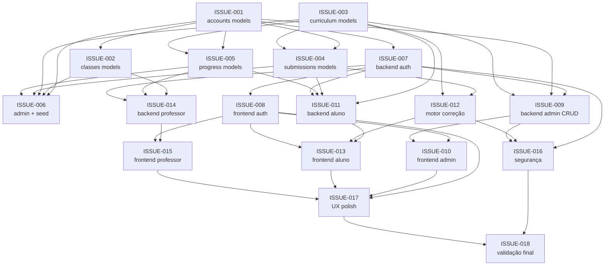

---

## Ordem de Execução por Prioridade

### 🔴 Camada 1 — Sem dependências (executar em paralelo)
| # | Issue | Título | Tamanho | Precisa quebrar? |
|---|-------|--------|---------|-----------------|
| 1 | ISSUE-001 | App `accounts` — User + Profiles | **P** | ❌ Não — 6 tarefas pontuais e claras |
| 2 | ISSUE-003 | App `curriculum` — Módulos, Aulas, Vídeos, Exercícios | **M** | ❌ Não — mas é a maior da Fase 0 (5 models) |

### 🟠 Camada 2 — Depende da Camada 1
| # | Issue | Título | Tamanho | Precisa quebrar? |
|---|-------|--------|---------|-----------------|
| 3 | ISSUE-002 | App `classes` — Turmas e Matrículas | **P** | ❌ Não — 2 models simples |
| 4 | ISSUE-004 | App `submissions` — Submissão e Resultado | **P** | ❌ Não — 2 models simples |
| 5 | ISSUE-005 | App `progress` — Progresso do Aluno | **P** | ❌ Não — 3 models com mesmo pattern |
| 6 | ISSUE-007 | Backend Auth — JWT, Registro, Permissions | **G** | ✅ **SIM** |

### 🟡 Camada 3 — Depende da Camada 2
| # | Issue | Título | Tamanho | Precisa quebrar? |
|---|-------|--------|---------|-----------------|
| 7 | ISSUE-006 | Admin Django + Seed | **M** | ❌ Não — mas depende de todas Fase 0 |
| 8 | ISSUE-008 | Frontend Auth — Login, Registro, Guards | **G** | ✅ **SIM** |
| 9 | ISSUE-009 | Backend Admin — CRUD Módulos, Aulas, Exercícios, Usuários | **GG** | ✅ **SIM** |

### 🟢 Camada 4 — Depende da Camada 3
| # | Issue | Título | Tamanho | Precisa quebrar? |
|---|-------|--------|---------|-----------------|
| 10 | ISSUE-010 | Frontend Admin — Telas de CRUD | **GG** | ✅ **SIM** |
| 11 | ISSUE-011 | Backend Aluno — Trilha, Submissão, Progresso | **GG** | ✅ **SIM** |
| 12 | ISSUE-012 | Motor de Correção Automática | **G** | ✅ **SIM** |

### 🔵 Camada 5 — Depende da Camada 4
| # | Issue | Título | Tamanho | Precisa quebrar? |
|---|-------|--------|---------|-----------------|
| 13 | ISSUE-013 | Frontend Aluno — Trilha, Aulas, Editor | **GG** | ✅ **SIM** |
| 14 | ISSUE-014 | Backend Professor — Turmas, Enrollment, Progresso | **G** | ✅ **SIM** |

### 🟣 Camada 6 — Depende da Camada 5
| # | Issue | Título | Tamanho | Precisa quebrar? |
|---|-------|--------|---------|-----------------|
| 15 | ISSUE-015 | Frontend Professor — Turmas, Alunos, Progresso | **G** | ✅ **SIM** |
| 16 | ISSUE-016 | Segurança — Rate Limiting, Sandbox, Auditoria | **G** | ✅ **SIM** |

### ⚫ Camada 7 — Última
| # | Issue | Título | Tamanho | Precisa quebrar? |
|---|-------|--------|---------|-----------------|
| 17 | ISSUE-017 | UX & Responsividade | **M** | ❌ Não — revisão transversal |
| 18 | ISSUE-018 | Validação Final — E2E, Performance | **G** | ✅ **SIM** |

> **Legenda de Tamanho**: **P** = Pequena (≤5 tarefas, 1-2 arquivos), **M** = Média (5-8 tarefas), **G** = Grande (>8 tarefas ou grande complexidade), **GG** = Muito Grande (múltiplos domínios, muitos endpoints/telas)

---

## Issues que NÃO precisam ser quebradas (7 de 18)

| Issue | Motivo |
|-------|--------|
| ISSUE-001 | 6 tarefas claras e auto-contidas (enums + models + migrations) |
| ISSUE-002 | 2 models simples com pattern idêntico |
| ISSUE-003 | 5 models, mas todos seguem o mesmo pattern — é a maior da Fase 0 mas ainda gerenciável |
| ISSUE-004 | 2 models simples |
| ISSUE-005 | 3 models com pattern repetitivo |
| ISSUE-006 | Admin + seed — tarefa mecânica |
| ISSUE-017 | Revisão transversal de UX — naturalmente iterativa |

---

## Decomposição Detalhada das 11 Issues Grandes

Abaixo, cada issue é decomposta em sub-issues com **dependências explícitas** entre elas (tanto internas quanto externas).

---

### 1. ISSUE-007 — Backend Auth (Fase 1) ⭐ Alta Prioridade

**Motivo da quebra**: 7 tarefas com domínios muito distintos (JWT, registro, permissions, recuperação de senha, testes).

| Sub-Issue | Título | Depende de (externa) | Depende de (interna) |
|-----------|--------|----------------------|----------------------|
| **007-A** | JWT custom — incluir `role` no payload + endpoint `/me/` + bloquear login inativo | ISSUE-001 (User+Profiles) | — |
| **007-B** | Endpoint de registro público (`POST /auth/register/`) — cria User + StudentProfile | ISSUE-001 (User+Profiles) | — |
| **007-C** | Permissions customizadas (`IsStudent`, `IsTeacher`, `IsAdmin`, `IsActiveAccount`) | ISSUE-001 (User.role) | 007-A (precisa do JWT funcionando para testar) |
| **007-D** | Recuperação de senha (forgot + reset password por token) | ISSUE-001 (User) | 007-A (fluxo de auth precisa estar funcional) |
| **007-E** | Testes unitários de auth (todos os cenários) | ISSUE-001 | 007-A, 007-B, 007-C, 007-D (testa tudo) |

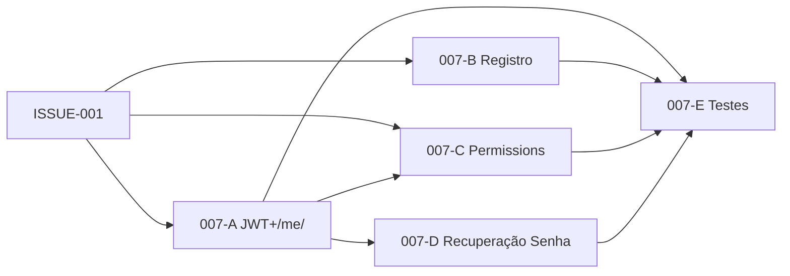

---

### 2. ISSUE-008 — Frontend Auth (Fase 1) ⭐ Alta Prioridade

**Motivo da quebra**: 8 tarefas cobrindo múltiplas páginas + guards + layout base.

| Sub-Issue | Título | Depende de (externa) | Depende de (interna) |
|-----------|--------|----------------------|----------------------|
| **008-A** | Tela de Login + redirecionamento pós-login por role | 007-A (JWT login funcional), 007-C (roles no token) | — |
| **008-B** | Tela de Registro + Tela de Forgot Password | 007-B (endpoint registro), 007-D (endpoint reset) | — |
| **008-C** | Telas de erro (Unauthorized 401 + Not Found 404) | — (sem dependência de backend) | — |
| **008-D** | Guards de rota (`ProtectedRoute`, `StudentRoute`, `TeacherRoute`, `AdminRoute`) | 007-A (JWT auth + role), 007-C (permissions conceituais) | 008-A (precisa do auth context) |
| **008-E** | Layout base com navegação por perfil (sidebar/nav diferenciado) | 007-A (role no /me/) | 008-A (auth context), 008-D (guards) |
| **008-F** | Testes E2E de login e registro (Playwright) | 007-E (backend auth testado) | 008-A, 008-B, 008-D, 008-E (tudo no frontend) |

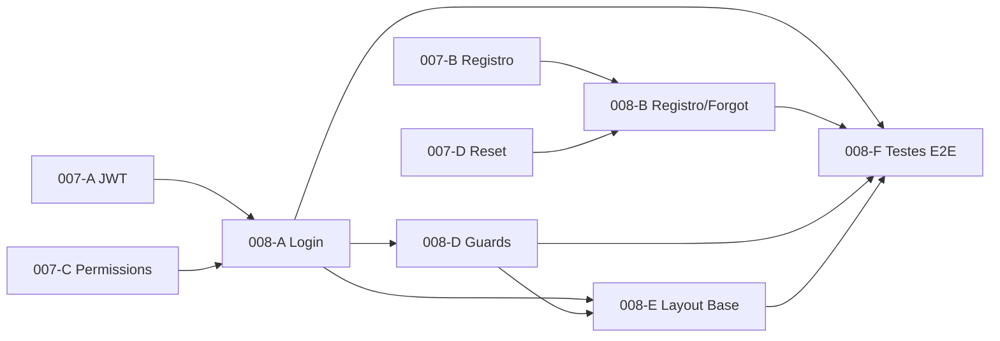

---

### 3. ISSUE-009 — Backend Admin CRUD (Fase 2) ⭐⭐ Muito Grande

**Motivo da quebra**: 9 tarefas com 6 CRUDs distintos + regras de negócio + testes.

| Sub-Issue | Título | Depende de (externa) | Depende de (interna) |
|-----------|--------|----------------------|----------------------|
| **009-A** | CRUD de Module (serializer, service, view, URLs) | ISSUE-003 (Module model), 007-C (IsAdmin permission) | — |
| **009-B** | CRUD de Lesson + VideoLesson (nested sob Module) | ISSUE-003 (Lesson, VideoLesson), 007-C | 009-A (módulo precisa existir para nested) |
| **009-C** | CRUD de Exercise + ExerciseTestCase (nested sob Lesson) | ISSUE-003 (Exercise, ExerciseTestCase), 007-C | 009-B (aula precisa existir para nested) |
| **009-D** | CRUD de User (admin, com criação por role e profile) | ISSUE-001 (User+Profiles), 007-C (IsAdmin) | — |
| **009-E** | Regras BR-008 e BR-010 (validações de publicação) | ISSUE-003 | 009-B (BR-008: validar aula), 009-C (BR-010: validar exercício) |
| **009-F** | Testes unitários (serializers e services) | ISSUE-003, ISSUE-001 | 009-A, 009-B, 009-C, 009-D, 009-E (testa tudo) |

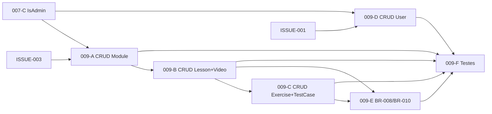

---

### 4. ISSUE-010 — Frontend Admin (Fase 2) ⭐⭐ Muito Grande

**Motivo da quebra**: 8 tarefas com 5+ telas complexas (CRUD completo).

| Sub-Issue | Título | Depende de (externa) | Depende de (interna) |
|-----------|--------|----------------------|----------------------|
| **010-A** | Layout admin (sidebar, header, breadcrumb) + Dashboard | 008-E (layout base), 008-D (AdminRoute guard) | — |
| **010-B** | CRUD Módulos (list, create, edit, detail) | 009-A (API CRUD Module) | 010-A (layout admin) |
| **010-C** | CRUD Aulas + Exercícios (nested, com test cases) | 009-B (API Lesson), 009-C (API Exercise) | 010-B (módulo como contexto pai) |
| **010-D** | CRUD Usuários (list, create, edit, detail por role) | 009-D (API CRUD User) | 010-A (layout admin) |
| **010-E** | Visão de turmas (read-only) | ISSUE-002 (ClassGroup model — apenas leitura) | 010-A (layout admin) |
| **010-F** | Testes E2E (J-007, J-008) | 009-F (backend testado) | 010-B, 010-C, 010-D (telas implementadas) |

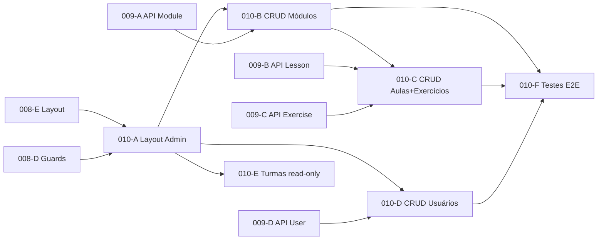

---

### 5. ISSUE-011 — Backend Aluno (Fase 3) ⭐⭐ Muito Grande

**Motivo da quebra**: 6 tarefas com 3 domínios distintos (leitura curriculum, submissão, progresso).

| Sub-Issue | Título | Depende de (externa) | Depende de (interna) |
|-----------|--------|----------------------|----------------------|
| **011-A** | Endpoints de leitura (módulos, aulas, exercícios publicados) | ISSUE-003 (curriculum models), 007-C (IsStudent) | — |
| **011-B** | Service de submissão de código + endpoint | ISSUE-004 (Submission model), ISSUE-003 (Exercise), 007-C | — |
| **011-C** | Service de progresso automático (lesson, exercise, module) | ISSUE-005 (progress models), ISSUE-003, ISSUE-004 | 011-B (progresso atualiza após submissão) |
| **011-D** | Endpoints de histórico de submissões + progresso consolidado | ISSUE-004, ISSUE-005, 007-C | 011-B (submissões precisam existir), 011-C (progresso precisa estar sendo rastreado) |
| **011-E** | Testes unitários (progress + submission services) | Todos acima | 011-A, 011-B, 011-C, 011-D |

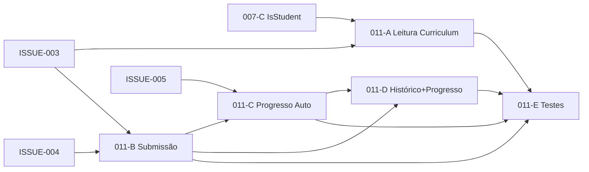

---

### 6. ISSUE-012 — Motor de Correção (Fase 3) ⭐⭐ Crítica/Complexa

**Motivo da quebra**: Alta complexidade técnica (Celery + sandbox + execução isolada).

| Sub-Issue | Título | Depende de (externa) | Depende de (interna) |
|-----------|--------|----------------------|----------------------|
| **012-A** | Celery task básica (recebe submission_id, atualiza status) | ISSUE-004 (Submission model) | — |
| **012-B** | Executor de sandbox (subprocess/Docker, com limites) | — (isolada tecnicamente) | — |
| **012-C** | Avaliação por test cases (comparação output, cálculo score) | ISSUE-003 (ExerciseTestCase) | 012-A (task recebe a submission), 012-B (sandbox executa o código) |
| **012-D** | Gerar SubmissionResult + feedback pedagógico | ISSUE-004 (SubmissionResult model) | 012-C (resultado da avaliação) |
| **012-E** | Tratamento de erros e timeout | — | 012-B (sandbox), 012-C (avaliação) |
| **012-F** | Testes unitários (sucesso, falha, timeout, erro) | ISSUE-003, ISSUE-004 | 012-A a 012-E (testa tudo) |

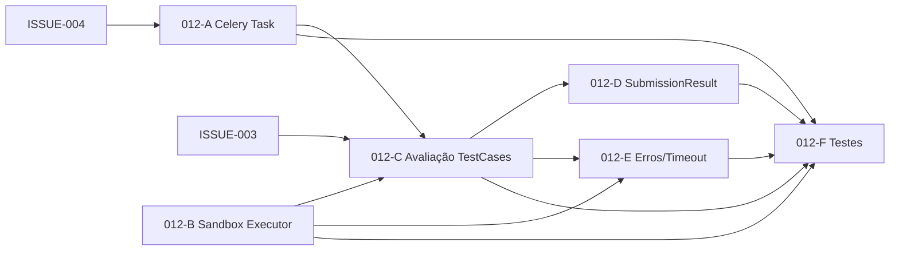

> ⚠️ **012-B (Sandbox)** é independente e pode ser desenvolvida em paralelo com 012-A. É a sub-issue mais complexa tecnicamente.

---

### 7. ISSUE-013 — Frontend Aluno (Fase 3) ⭐⭐ Muito Grande

**Motivo da quebra**: 9 tarefas, muitas telas, editor de código integrado.

| Sub-Issue | Título | Depende de (externa) | Depende de (interna) |
|-----------|--------|----------------------|----------------------|
| **013-A** | Layout aluno (nav superior) + Dashboard/Trilha | 008-E (layout base), 008-D (StudentRoute), 011-A (API leitura módulos) | — |
| **013-B** | Lista de módulos + Detalhe do módulo | 011-A (API leitura módulos), 011-D (progresso) | 013-A (layout aluno) |
| **013-C** | Tela de aula (vídeo + conteúdo markdown + exercícios) | 011-A (API leitura aulas) | 013-B (navegação para aula vem do módulo) |
| **013-D** | Tela de exercício com Editor de Código (Monaco) + submissão | 011-B (API submissão), 012-D (SubmissionResult) | 013-C (navegação para exercício vem da aula) |
| **013-E** | Painel de resultado + histórico de tentativas | 011-D (API histórico submissões), 012-D (resultado) | 013-D (exibido no contexto do exercício) |
| **013-F** | Tela de progresso + Tela de histórico de submissões | 011-D (API progresso consolidado + histórico) | 013-A (navegação do aluno) |
| **013-G** | Testes E2E (J-002, J-003, J-004) | 011-E (backend testado), 012-F (motor testado) | 013-A a 013-F (tudo implementado) |

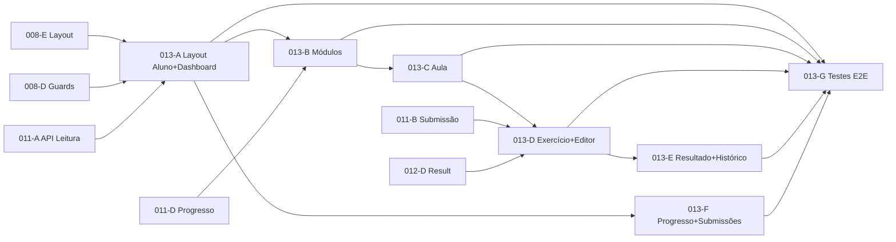

---

### 8. ISSUE-014 — Backend Professor (Fase 4)

**Motivo da quebra**: 6 tarefas com CRUD + lógica de autorização complexa (BR-016).

| Sub-Issue | Título | Depende de (externa) | Depende de (interna) |
|-----------|--------|----------------------|----------------------|
| **014-A** | CRUD ClassGroup (professor cria/edita suas turmas) | ISSUE-002 (ClassGroup model), 007-C (IsTeacher) | — |
| **014-B** | CRUD ClassEnrollment (associar/remover alunos) | ISSUE-002 (ClassEnrollment model), ISSUE-001 (StudentProfile) | 014-A (turma precisa existir) |
| **014-C** | Progresso coletivo + individual do aluno na turma | ISSUE-005 (progress models), 011-C (progresso sendo rastreado) | 014-A (turma), 014-B (alunos na turma) |
| **014-D** | Testes unitários de autorização (BR-016, BR-004, BR-005) | ISSUE-002, ISSUE-005 | 014-A, 014-B, 014-C |

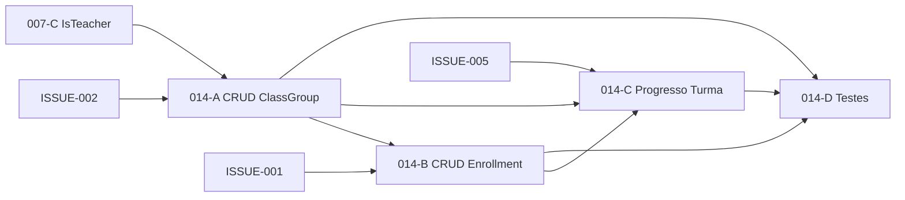

---

### 9. ISSUE-015 — Frontend Professor (Fase 4)

**Motivo da quebra**: 6 tarefas com múltiplas telas CRUD + progresso.

| Sub-Issue | Título | Depende de (externa) | Depende de (interna) |
|-----------|--------|----------------------|----------------------|
| **015-A** | Layout professor (sidebar) + Dashboard | 008-E (layout base), 008-D (TeacherRoute) | — |
| **015-B** | CRUD de turmas (list, new, detail, edit) | 014-A (API turmas), 014-B (API enrollment) | 015-A (layout) |
| **015-C** | Lista consolidada de alunos + progresso individual | 014-C (API progresso turma) | 015-B (navegação vem da turma) |
| **015-D** | Testes E2E (J-005, J-006) | 014-D (backend testado) | 015-A, 015-B, 015-C (tudo) |

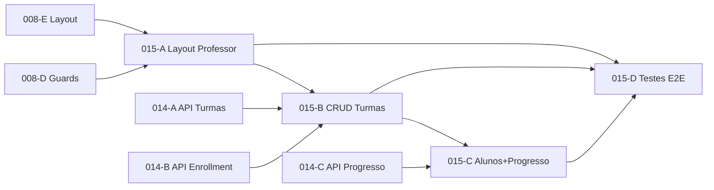

---

### 10. ISSUE-016 — Segurança (Fase 5)

**Motivo da quebra**: 5 tarefas com domínios distintos (rate limiting, sandbox, auditoria, CORS).

| Sub-Issue | Título | Depende de (externa) | Depende de (interna) |
|-----------|--------|----------------------|----------------------|
| **016-A** | Rate limiting (login + submissões) | 007-A (login endpoint), 011-B (submissões endpoint) | — |
| **016-B** | Validação de entrada (revisão de serializers existentes) | 009-A a 009-D (serializers admin), 011-A a 011-B (serializers aluno) | — |
| **016-C** | Hardening do sandbox (rede, disco, CPU, memória) | 012-B (sandbox implementado) | — |
| **016-D** | Auditoria de ações admin + CORS/CSRF/headers | 009-A a 009-D (rotas admin) | — |

> ⚠️ Todas as sub-issues de 016 são **independentes entre si** e podem ser executadas em paralelo.

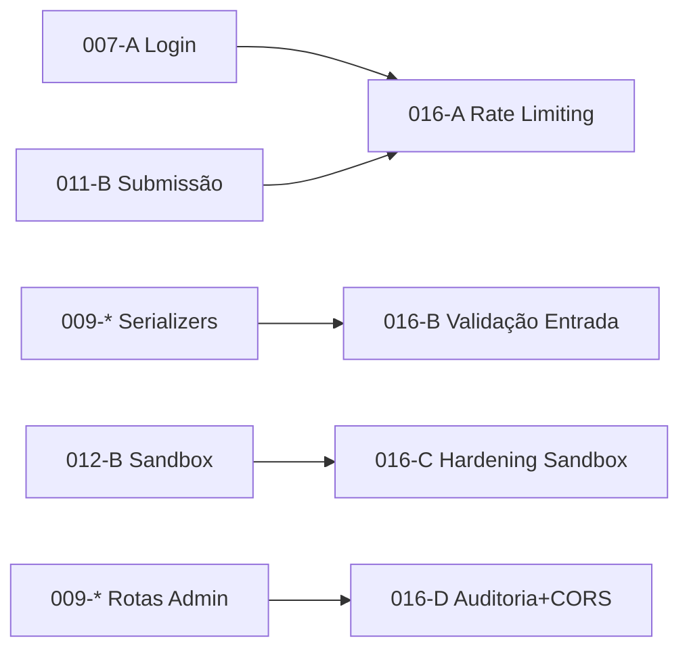

---

### 11. ISSUE-018 — Validação Final (Fase 5)

**Motivo da quebra**: 4 macro-tarefas abrangendo toda a plataforma.

| Sub-Issue | Título | Depende de (externa) | Depende de (interna) |
|-----------|--------|----------------------|----------------------|
| **018-A** | Suite E2E completa (J-001 a J-008) | 008-F, 010-F, 013-G, 015-D (todos os testes E2E) | — |
| **018-B** | Testes de segurança do sandbox | 016-C (sandbox hardened) | — |
| **018-C** | Testes de performance do motor de correção | 012-F (motor testado), 016-A (rate limiting) | — |
| **018-D** | Revisão da matriz de autorização (role × resource × action) | 007-C (permissions), 009-F, 011-E, 014-D (todos backends testados) | — |

> ⚠️ As sub-issues de 018 são **independentes entre si**, mas cada uma depende de que o "mundo" esteja pronto.

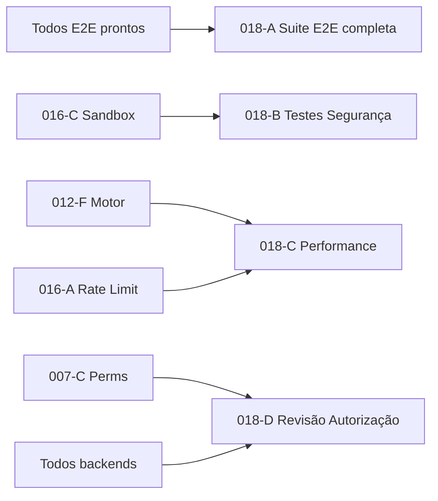

---

## Grafo Completo de Sub-Issues (Visão Consolidada)

```mermaid
graph TD
    subgraph "Camada 1 — Fundação"
        I001[ISSUE-001 accounts]
        I003[ISSUE-003 curriculum]
    end

    subgraph "Camada 2 — Models + Auth"
        I002[ISSUE-002 classes]
        I004[ISSUE-004 submissions]
        I005[ISSUE-005 progress]
        S007A[007-A JWT+/me/]
        S007B[007-B Registro]
        S007C[007-C Permissions]
        S007D[007-D Reset Senha]
        S007E[007-E Testes Auth]
    end

    subgraph "Camada 3 — Frontend Auth + Admin Backend"
        I006[ISSUE-006 Admin+Seed]
        S008A[008-A Login]
        S008B[008-B Registro+Forgot]
        S008C[008-C Telas Erro]
        S008D[008-D Guards]
        S008E[008-E Layout Base]
        S008F[008-F Testes E2E Auth]
        S009A[009-A CRUD Module]
        S009B[009-B CRUD Lesson]
        S009C[009-C CRUD Exercise]
        S009D[009-D CRUD User]
        S009E[009-E BR-008/010]
        S009F[009-F Testes Admin]
    end

    subgraph "Camada 4 — Frontend Admin + Backend Aluno + Motor"
        S010A[010-A Layout Admin]
        S010B[010-B CRUD Módulos UI]
        S010C[010-C CRUD Aulas UI]
        S010D[010-D CRUD Users UI]
        S010E[010-E Turmas RO]
        S010F[010-F Testes Admin UI]
        S011A[011-A Leitura Curriculum]
        S011B[011-B Submissão]
        S011C[011-C Progresso Auto]
        S011D[011-D Histórico]
        S011E[011-E Testes Aluno]
        S012A[012-A Celery Task]
        S012B[012-B Sandbox]
        S012C[012-C Avaliação]
        S012D[012-D Result+Feedback]
        S012E[012-E Erros/Timeout]
        S012F[012-F Testes Motor]
    end

    %% Camada 1 → 2
    I001 --> I002
    I001 --> I004
    I001 --> I005
    I001 --> S007A
    I001 --> S007B
    I003 --> I004
    I003 --> I005

    %% Camada 2 interna
    S007A --> S007C
    S007A --> S007D
    S007A --> S007E
    S007B --> S007E
    S007C --> S007E
    S007D --> S007E

    %% Camada 2 → 3
    I001 --> I006
    I002 --> I006
    I003 --> I006
    I004 --> I006
    I005 --> I006
    S007A --> S008A
    S007C --> S008A
    S007B --> S008B
    S007D --> S008B
    S008A --> S008D
    S008A --> S008E
    S008D --> S008E
    S008A --> S008F
    S008B --> S008F
    S008D --> S008F
    S008E --> S008F
    I003 --> S009A
    S007C --> S009A
    S009A --> S009B
    S009B --> S009C
    I001 --> S009D
    S007C --> S009D
    S009B --> S009E
    S009C --> S009E
    S009A --> S009F
    S009B --> S009F
    S009C --> S009F
    S009D --> S009F
    S009E --> S009F

    %% Camada 3 → 4
    S008E --> S010A
    S008D --> S010A
    S010A --> S010B
    S009A --> S010B
    S010B --> S010C
    S009B --> S010C
    S009C --> S010C
    S010A --> S010D
    S009D --> S010D
    S010A --> S010E
    S010B --> S010F
    S010C --> S010F
    S010D --> S010F
    I003 --> S011A
    S007C --> S011A
    I004 --> S011B
    I003 --> S011B
    I005 --> S011C
    S011B --> S011C
    S011B --> S011D
    S011C --> S011D
    S011A --> S011E
    S011B --> S011E
    S011C --> S011E
    S011D --> S011E
    I004 --> S012A
    I003 --> S012C
    S012A --> S012C
    S012B --> S012C
    S012C --> S012D
    S012B --> S012E
    S012C --> S012E
    S012A --> S012F
    S012B --> S012F
    S012C --> S012F
    S012D --> S012F
    S012E --> S012F
```

---

## Caminho Crítico

O **caminho mais longo** do projeto (que define o tempo mínimo de entrega) é:

```
ISSUE-001 → 007-A → 007-C → 009-A → 009-B → 009-C → 009-E → 009-F
                                                          ↓
ISSUE-003 → ISSUE-004 → 011-B → 011-C → 011-D → 011-E
                                    ↓
                              012-A → 012-C → 012-D → 012-F
                                                        ↓
                                          013-D → 013-E → 013-G
                                                            ↓
                                                  ISSUE-017 → ISSUE-018
```

**Estimativa do caminho crítico**: ~14 etapas sequenciais.

---

## Próximos Passos Recomendados

1. **Decidir se quer criar as sub-issues como arquivos** (ex: `ISSUE-007-A.md`, `ISSUE-007-B.md`) e atualizar o tracker
2. **Começar pela Camada 1**: ISSUE-001 e ISSUE-003 podem ser executadas em paralelo
3. **Definir GAPs pendentes** (mencionados no roadmap):
   - GAP #1: Qual linguagem de programação os exercícios suportarão? (mencionado em ISSUE-012)
