# Ingenia — Roadmap de Implementação

> Plataforma de Ensino Introdutório de Programação para alunos do 8º e 9º ano.

## Stack Definida (via `.context.md`)

| Camada | Tecnologia |
|--------|-----------|
| Backend | Django 5 + DRF, Python 3.14, Celery, PostgreSQL, Redis |
| Frontend | Vite + React + TypeScript + Mantine v7 |
| Infra | Docker Compose, uv (backend), pnpm (frontend) |
| Testes | pytest, vitest, Playwright |

---

## Visão Geral das Fases

```mermaid
gantt
    title Roadmap Ingenia — Fases de Implementação
    dateFormat X
    axisFormat %s
    
    section Fase 0 — Fundação
    Models + Migrations          :f0a, 0, 2
    Enums + Base config          :f0b, 0, 1
    
    section Fase 1 — Autenticação
    Auth (JWT + Roles)           :f1a, 2, 4
    Registro + Login Frontend    :f1b, 3, 5
    
    section Fase 2 — Admin: Conteúdo
    CRUD Módulos                 :f2a, 5, 7
    CRUD Aulas + Vídeo           :f2b, 6, 8
    CRUD Exercícios + Testes     :f2c, 7, 9
    Telas Admin Frontend         :f2d, 6, 10
    
    section Fase 3 — Aluno: Trilha
    Trilha + Progresso           :f3a, 10, 12
    Consumo de Aula              :f3b, 11, 13
    Editor + Submissão           :f3c, 12, 15
    Correção Automática          :f3d, 13, 16
    Telas Aluno Frontend         :f3e, 10, 16
    
    section Fase 4 — Professor
    Turmas + Enrollment          :f4a, 16, 18
    Painel + Progresso Alunos    :f4b, 17, 19
    Telas Professor Frontend     :f4c, 16, 19
    
    section Fase 5 — Polish
    Segurança + Rate Limiting    :f5a, 19, 20
    UX + Responsividade          :f5b, 19, 21
    E2E + Validação Final        :f5c, 20, 22
```

---

## Fase 0 — Fundação (Models & Infraestrutura)

> **Objetivo:** Criar todos os models, enums e migrations que sustentam o domínio.

### Backend

#### App `accounts` (existente — estender)
- [ ] Estender `User` model com campos: `role` (UserRole), `account_status` (AccountStatus), `last_login_at`
- [ ] Criar models `StudentProfile`, `TeacherProfile`, `AdminProfile` (1:1 com User)
- [ ] Implementar enums: `UserRole`, `AccountStatus`, `LearningStatus`

#### App `classes` (novo)
- [ ] Model `ClassGroup` (teacher_profile, name, description, class_status)
- [ ] Model `ClassEnrollment` (class_group, student_profile, enrolled_at, enrollment_status)
- [ ] Enums: `ClassStatus`, `EnrollmentStatus`

#### App `curriculum` (novo)
- [ ] Model `Module` (title, description, sequence_order, publication_status)
- [ ] Model `Lesson` (module, title, written_content, sequence_order, publication_status)
- [ ] Model `VideoLesson` (lesson 1:1, title, video_url, duration_seconds)
- [ ] Model `Exercise` (lesson, title, statement, support_message, sequence_order, publication_status)
- [ ] Model `ExerciseTestCase` (exercise, name, input_data, expected_output, sequence_order, is_hidden)
- [ ] Enum: `ContentStatus`

#### App `submissions` (novo)
- [ ] Model `Submission` (exercise, student_profile, source_code, evaluation_status, score_percentage, submitted_at)
- [ ] Model `SubmissionResult` (submission 1:1, passed/failed counts, feedback_message, result_status)
- [ ] Enums: `SubmissionStatus`, `ResultStatus`

#### App `progress` (novo)
- [ ] Model `StudentModuleProgress` (student_profile, module, progress_status, started_at, completed_at)
- [ ] Model `StudentLessonProgress` (student_profile, lesson, progress_status, started_at, completed_at)
- [ ] Model `StudentExerciseProgress` (student_profile, exercise, progress_status, attempts_count, first_attempt_at, completed_at)
- [ ] Enum: `ProgressStatus`

### Entregáveis
- Migrations rodando sem erro
- Admin do Django registrando todos os models
- Seed básico funcional

---

## Fase 1 — Autenticação & Autorização

> **Objetivo:** Login, registro, controle de acesso por role e redirecionamento por perfil.

### Backend
- [ ] JWT auth (já existente no template — adaptar para `role`)
- [ ] Endpoint de registro público (cria User + StudentProfile)
- [ ] Serializers de User com role e account_status
- [ ] Permissions customizadas: `IsStudent`, `IsTeacher`, `IsAdmin`
- [ ] Endpoint `/api/v1/auth/me/` retornando role e profile info
- [ ] Bloquear login se `account_status != ACTIVE`
- [ ] Endpoint de recuperação de senha (básico)

### Frontend (domain `auth`)
- [ ] Tela `/login` (J-001)
- [ ] Tela `/register` (cadastro de aluno)
- [ ] Tela `/forgot-password`
- [ ] Telas `/unauthorized` e `/not-found`
- [ ] Redirecionamento pós-login por `role` → `/student`, `/teacher` ou `/admin`
- [ ] Guards de rota por role (ProtectedRoute)
- [ ] Layout base com navegação por perfil

### Validação
- Testes unitários de auth (pytest)
- Teste E2E de login e registro (Playwright)

---

## Fase 2 — Administração de Conteúdo

> **Objetivo:** Admin gerencia módulos, aulas, vídeos, exercícios e test cases. Admin gerencia usuários.

### Backend
- [ ] CRUD completo de `Module` (list, create, retrieve, update, delete)
- [ ] CRUD de `Lesson` (nested sob Module)
- [ ] CRUD de `VideoLesson` (inline com Lesson)
- [ ] CRUD de `Exercise` (nested sob Lesson)
- [ ] CRUD de `ExerciseTestCase` (nested sob Exercise)
- [ ] CRUD de `User` (admin only — criar com profile correspondente)
- [ ] Filtros: `publication_status`, busca por título
- [ ] Regra BR-010: impedir publicação de exercício sem test cases
- [ ] Regra BR-008: validar que aula tenha vídeo e conteúdo escrito ao publicar

### Frontend (domain `admin`)
- [ ] Layout admin com sidebar
- [ ] Dashboard admin (`/admin`)
- [ ] CRUD Módulos (`/admin/modules/*`)
- [ ] CRUD Aulas dentro de módulo (`/admin/modules/:id/lessons/*`)
- [ ] CRUD Exercícios dentro de aula (`/admin/modules/:id/lessons/:id/exercises/*`)
- [ ] CRUD Usuários (`/admin/users/*`)
- [ ] Visão administrativa de turmas (`/admin/classes`)

### Validação
- Testes unitários dos serializers e services (pytest)
- Testes E2E do fluxo J-007 e J-008 (Playwright)

---

## Fase 3 — Experiência do Aluno (Trilha & Exercícios)

> **Objetivo:** Aluno percorre trilha, consome aulas, submete código e recebe correção automática.

### Backend
- [ ] Endpoints de leitura de Módulos/Aulas/Exercícios (filtro `publication_status=PUBLISHED`)
- [ ] Service de submissão de código (criar `Submission`, chamar avaliação)
- [ ] **Motor de correção automática** (Celery task):
  - Recebe source code + test cases
  - Executa em sandbox (Docker container isolado ou subprocess com limits)
  - Compara output × expected_output para cada test case
  - Gera `SubmissionResult` com contagem de passed/failed + feedback
- [ ] Service de progresso:
  - Atualizar `StudentLessonProgress` ao consumir aula
  - Atualizar `StudentExerciseProgress` ao submeter exercício (BR-014, BR-020)
  - Atualizar `StudentModuleProgress` quando todas aulas/exercícios concluídos (BR-015)
  - Atualizar `StudentProfile.learning_status` quando toda trilha concluída
- [ ] Endpoint de histórico de submissões do aluno
- [ ] Endpoint de progresso do aluno (consolidado)

### Frontend (domain `student`)
- [ ] Layout do aluno com navegação superior
- [ ] Dashboard / Trilha (`/student`) com cards de módulos e progresso
- [ ] Lista de módulos (`/student/modules`) com filtros
- [ ] Detalhe do módulo (`/student/modules/:id`) com lista de aulas
- [ ] Tela de aula (`/student/modules/:id/lessons/:id`):
  - Player de vídeo
  - Bloco de conteúdo escrito (markdown render)
  - Lista de exercícios
- [ ] Tela de exercício (`/student/modules/:id/lessons/:id/exercises/:id`):
  - Enunciado
  - **Editor de código** (Monaco Editor ou CodeMirror)
  - Botão submeter
  - Painel de resultado (loading → passed/failed com feedback)
  - Histórico de tentativas
- [ ] Tela de progresso (`/student/progress`)
- [ ] Tela de histórico de submissões (`/student/submissions`)

### Validação
- Testes unitários do motor de correção (pytest)
- Testes E2E dos fluxos J-002, J-003, J-004 (Playwright)
- Teste manual de segurança do sandbox

---

## Fase 4 — Experiência do Professor (Turmas & Progresso)

> **Objetivo:** Professor gerencia turmas, acompanha progresso coletivo e individual.

### Backend
- [ ] CRUD `ClassGroup` (professor cria/edita suas turmas — BR-004)
- [ ] CRUD `ClassEnrollment` (associar/remover alunos — BR-005)
- [ ] Endpoint de progresso coletivo da turma (agregado)
- [ ] Endpoint de progresso individual do aluno (escopo da turma — BR-016)
- [ ] Autorização: professor vê apenas alunos das suas turmas

### Frontend (domain `teacher`)
- [ ] Layout do professor
- [ ] Dashboard professor (`/teacher`)
- [ ] CRUD de turmas (`/teacher/classes/*`)
- [ ] Detalhe da turma com indicadores (`/teacher/classes/:id`)
- [ ] Editar turma: adicionar/remover alunos (`/teacher/classes/:id/edit`)
- [ ] Lista consolidada de alunos (`/teacher/students`)
- [ ] Progresso individual do aluno (`/teacher/classes/:id/students/:id`)

### Validação
- Testes unitários de autorização e services (pytest)
- Testes E2E dos fluxos J-005 e J-006 (Playwright)

---

## Fase 5 — Segurança, Polish & Validação Final

> **Objetivo:** Hardening de segurança, UX polish, responsividade básica e testes end-to-end completos.

### Segurança
- [ ] Rate limiting em login e submissões (django-ratelimit ou throttle DRF)
- [ ] Validação de entrada em todas as rotas
- [ ] Garantir que sandbox de execução não acesse rede/disco do host
- [ ] Auditoria básica de ações administrativas
- [ ] Revisão de CORS, CSRF e headers de segurança

### UX & Responsividade
- [ ] Mensagens de erro pedagógicas (conforme UX Flows §5)
- [ ] Feedback visual de loading/empty/error em todas as telas
- [ ] Responsividade básica tablet/mobile
- [ ] Acessibilidade mínima (contraste, focus, labels)

### Validação Final
- [ ] Suite E2E cobrindo todas as 8 jornadas críticas
- [ ] Testes de segurança do sandbox
- [ ] Testes de performance do motor de correção
- [ ] Revisão completa da matriz de autorização

---

## Gaps Conhecidos (a validar com o cliente)

| # | Gap | Impacto |
|---|-----|---------|
| 1 | Linguagem de programação dos exercícios (Python? JS?) | Define sandbox, editor, test cases e conteúdo |
| 2 | Auto-cadastro de alunos em contexto escolar | Define se precisa de convite/aprovação  |
| 3 | Vídeos: upload próprio vs. link externo (YouTube)? | Define infra de storage |
| 4 | Dados de menores: consentimento, LGPD | Pode exigir fluxo de termos |
| 5 | Professor pode criar contas? | Afeta autorização |
| 6 | Campos editáveis pelo aluno no autoatendimento | Define tela de perfil |
| 7 | Conteúdo público sem login? | Afeta rotas e guards |
| 8 | Importação em lote de alunos/turmas? | Afeta UX admin e fluxo escolar |

---

## Estimativa de Esforço por Fase

| Fase | Backend | Frontend | Total Aprox. |
|------|---------|----------|-------------|
| 0 — Fundação | 2–3 dias | — | 2–3 dias |
| 1 — Auth | 2–3 dias | 3–4 dias | 5–7 dias |
| 2 — Admin Conteúdo | 4–5 dias | 5–7 dias | 9–12 dias |
| 3 — Aluno + Correção | 5–7 dias | 7–10 dias | 12–17 dias |
| 4 — Professor | 3–4 dias | 4–5 dias | 7–9 dias |
| 5 — Polish | 3–4 dias | 3–4 dias | 6–8 dias |
| **Total** | **19–26 dias** | **22–30 dias** | **~41–56 dias** |

> **Nota:** Estimativas para 1 dev fullstack. Paralelismo backend/frontend reduz significativamente.
